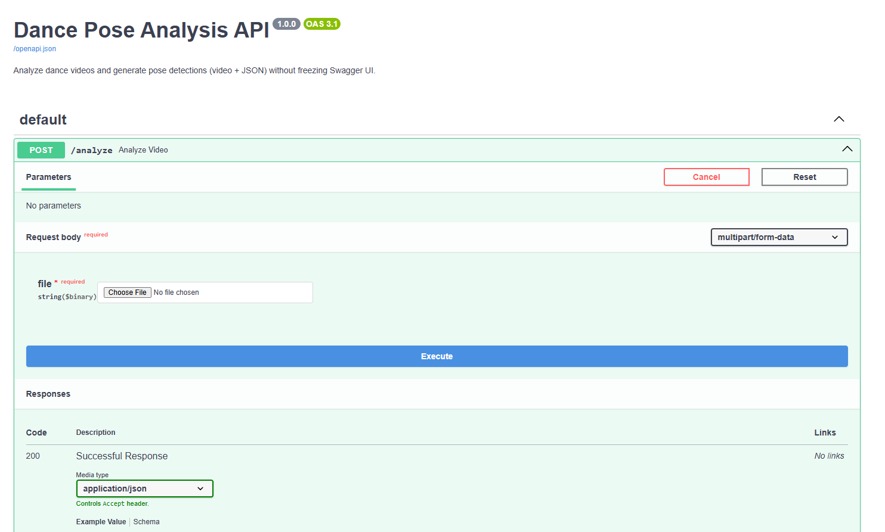
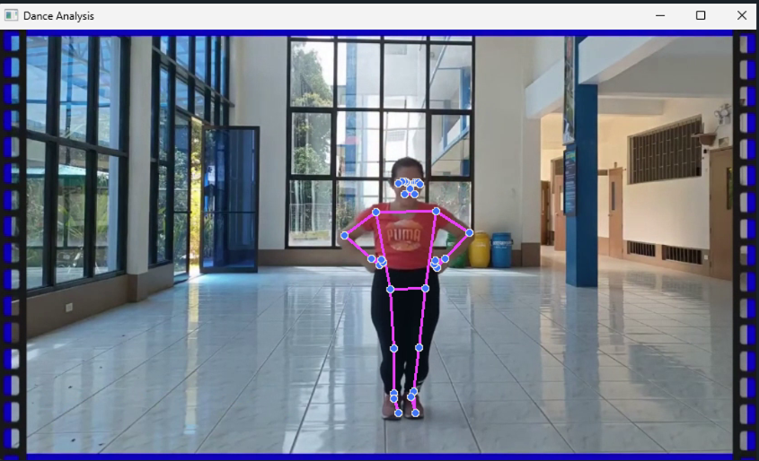

# Dance Movement AI

A FastAPI-based web service for analyzing dance videos and returning pose/action summaries.  
This project demonstrates pose estimation, action classification, and cloud deployment using Docker.

---

## Features

- Upload a **dance video** and receive:
  - Per-frame pose landmarks
  - Arm/leg action labels (e.g., "raised", "lifted")
  - Overall action **summary counts**
- Saves both:
  - Annotated video with skeleton overlay
  - JSON file with landmarks + actions
- REST API with **Swagger UI** documentation
- Dockerized for cloud deployment (AWS/GCP/VPS)

---

### FastAPI Swagger UI

Here’s a screenshot of the API documentation page:



### Dance Video Analysis Output

Check out the dance analysis output
   


---

## Endpoints

### `POST /analyze`
Upload a video file for analysis.

**Request:**
- `file`: Video file (e.g., `.mp4`)

**Response:**
- JSON with:
  - `summary` → counts of detected actions
  - `frames` → per-frame actions + landmarks

**Example:**
```json
{
  "summary": {
    "left_arm": { "down": 1223, "raised": 520 },
    "right_arm": { "down": 1152, "raised": 613 },
    "left_leg": { "down": 1771 },
    "right_leg": { "down": 1749, "lifted": 22 }
  },
  "frames": [
    {
      "frame": 0,
      "actions": {
        "left_arm": "down",
        "right_arm": "raised",
        "left_leg": "down",
        "right_leg": "down"
      },
      "landmarks": [...]
    }
  ]
}
```
### GET /
Health check endpoint.

**Response:**
```json
{ "message": "Dance Pose Analysis API is running!" }
```

### Usage
Local Development

 - Install dependencies:
   ```bash
   pip install -r requirements.txt
   ```

### Run the server:
```bash
uvicorn app.main:app --reload
```

### Access the API docs:

- Open http://localhost:8000/docs in your browser.

### Docker

- Build the Docker image:
  ```bash
  docker build -t dance-movement-ai .
  ```

- Run the container (local test):
  ```bash
  docker run -p 8000:8000 dance-movement-ai
  ```

- Or pull from Docker Hub:
  ```bash
  docker run -p 8000:8000 madhalasa/dance-movement-ai:latest
  ```


### Project Structure
```bash
dance-movement-ai/

├── app/

│   ├── main.py        # FastAPI API

│   ├── analysis.py    # Pose detection & JSON summary

│   ├── utils.py       # Helper functions (e.g., angle calculation)

│   └── tests/         # Unit tests

├── uploads/           # Uploaded videos 

├── outputs/           # Annotated videos & JSON results 

├── requirements.txt

├── Dockerfile

└── README.md
```

### Requirements

- Python 3.9+ (tested on 3.11)

- See requirements.txt for dependencies: fastapi, uvicorn, mediapipe, opencv-python, numpy

### Deployment

#### Live Demo

The project is deployed on AWS EC2 and accessible here:

[FastAPI Swagger UI](http://13.203.15.21:8000/docs)

You can upload a short dance video and get:
- An annotated video with pose landmarks.
- A JSON summary of detected poses.

